# ⚡ AWS Serverless Event Notification System

This project demonstrates a fully serverless, event-driven architecture on AWS. The idea is simple — someone submits an event through an API, and all subscribers automatically receive an email notification. What makes it interesting from an engineering perspective is how the services are wired together and the decisions behind each one.

Built first in the AWS Console to understand how each service behaves, then torn down and fully rebuilt in Terraform as infrastructure as code.

---

## 🏗️ Architecture Overview

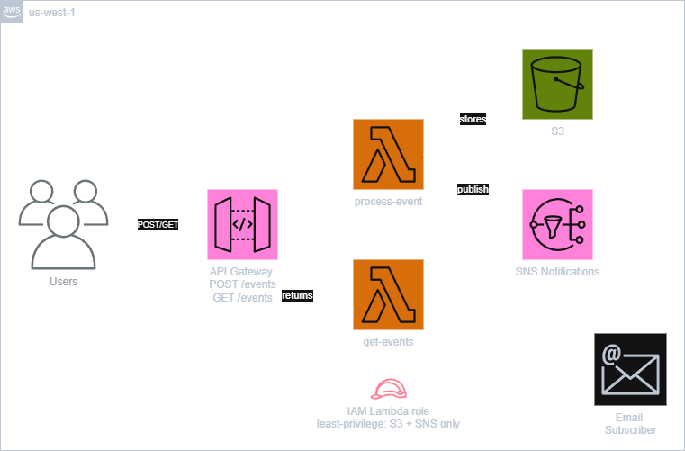

---

## 🛠️ AWS Services Used

| Service | Purpose |
|---|---|
| **API Gateway** | HTTP API endpoint receiving event submissions |
| **Lambda** | Serverless functions processing submissions and retrieving events |
| **SNS** | Fan-out email notifications to confirmed subscribers |
| **S3** | Stores events as a JSON file — no database needed at this scale |
| **IAM** | Least-privilege roles scoped to specific resources |
| **Terraform** | Full infrastructure as code using hashicorp/aws provider v5.0+ |

---

## 🔑 Key Design Decisions

**SNS over SES for Notifications**

SNS was chosen over SES because it supports fan-out delivery to multiple protocols — email, SMS, SQS, Lambda — from a single publish call. SES is email only. For a notification system that might expand beyond email, SNS is the more flexible foundation.

**S3 over DynamoDB for Storage**

For this project I chose S3 to store events as a JSON file rather than using DynamoDB. Since events are submitted infrequently and the data structure is simple, a flat JSON file was enough. DynamoDB would have been the right choice if I needed to query or filter events, but adding a database for something this straightforward felt like over-engineering. 

**HTTP API Gateway**

API Gateway was used to create a managed HTTP endpoint that triggers Lambda without exposing the function directly. It handles routing, CORS, and the integration with Lambda — removing the need to manage any server or networking layer. For this project I chose HTTP API over REST API because it was simpler to configure, lower cost, and fully sufficient for a basic POST and GET endpoint. REST API adds features like request validation, caching, and usage plans — none of which were needed here.

**Least-Privilege IAM**

The Lambda execution role is scoped to exactly what it needs:
- `s3:GetObject` and `s3:PutObject` on one specific bucket
- `sns:Publish` on one specific topic
- CloudWatch Logs for observability

Nothing else. This limits the blast radius if the function were ever compromised.

---

## 🌍 Infrastructure Overview

### S3 Bucket
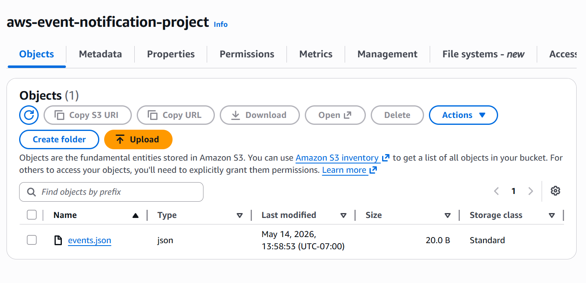

### SNS Topic with Confirmed Subscription
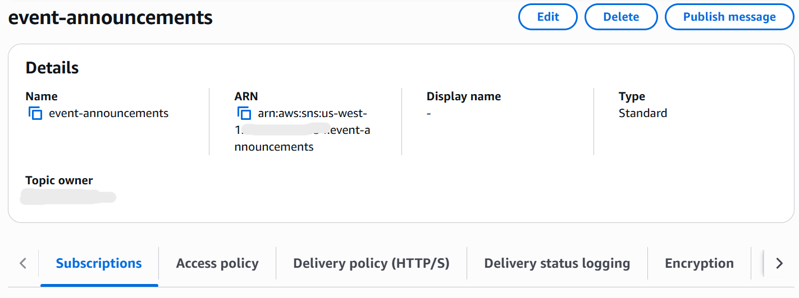
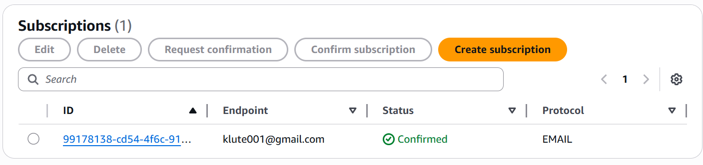

### Lambda Functions
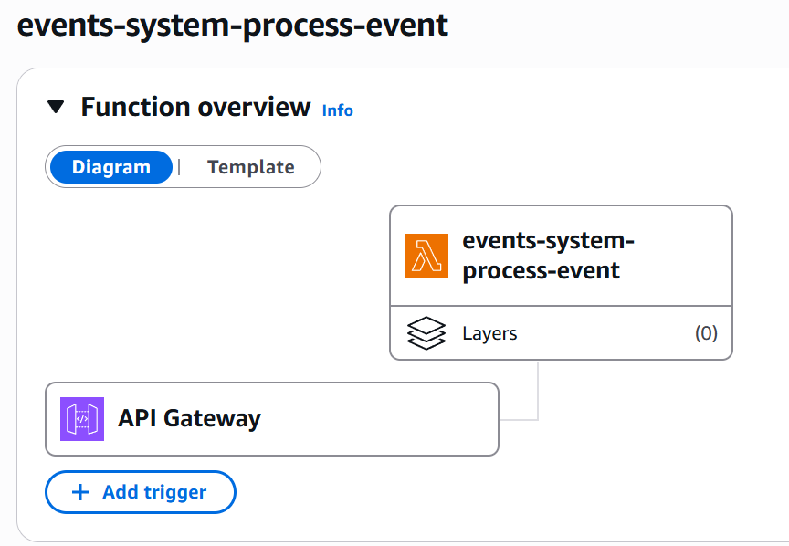
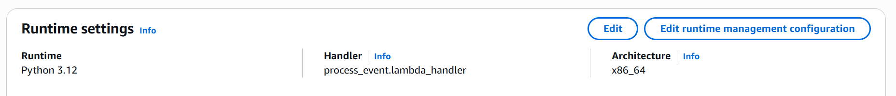
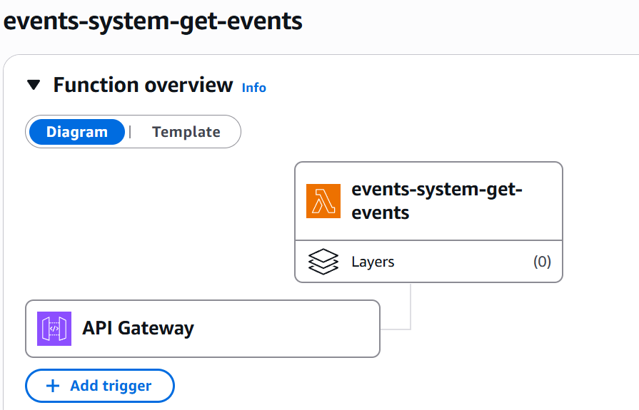
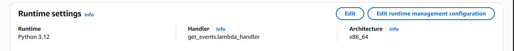
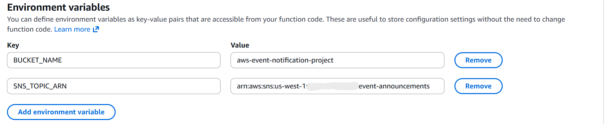

### IAM Policy
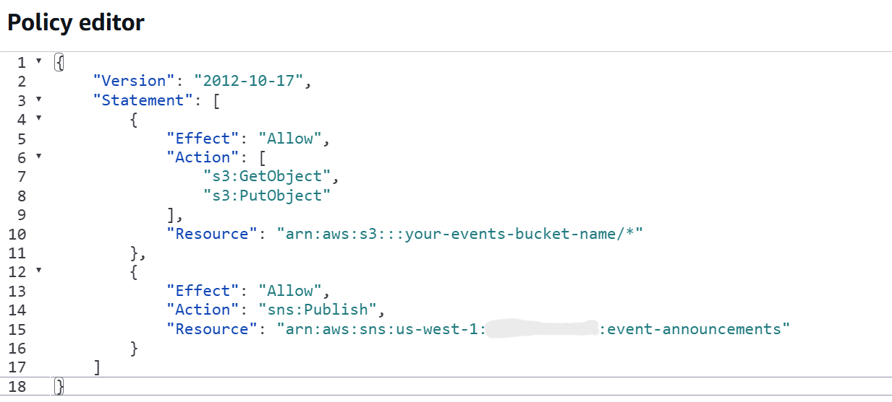

### API Gateway
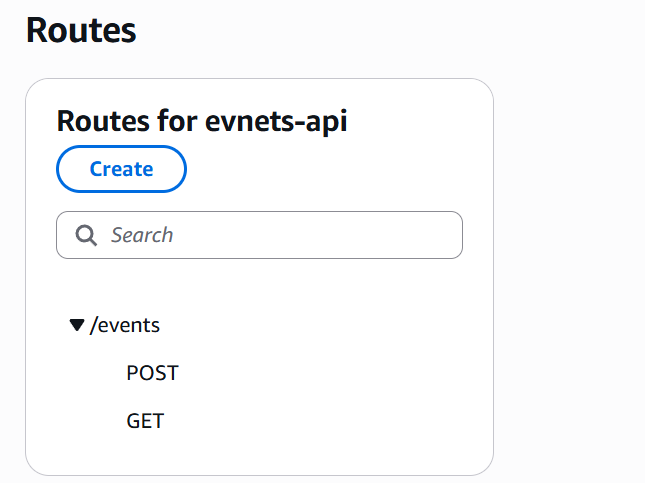

---

## ✅ Validation

### Successful POST Request
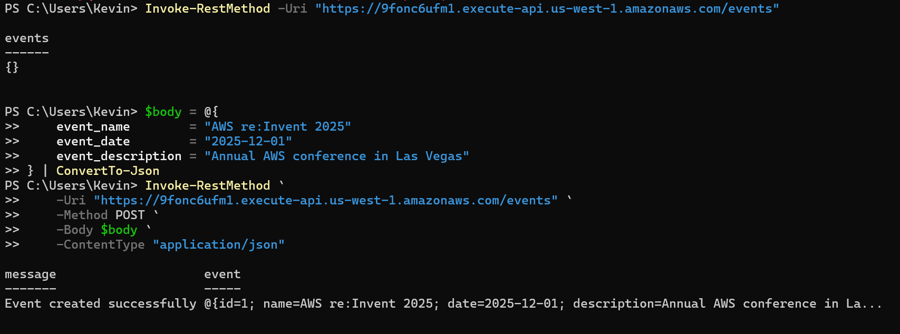

### Successful GET Request
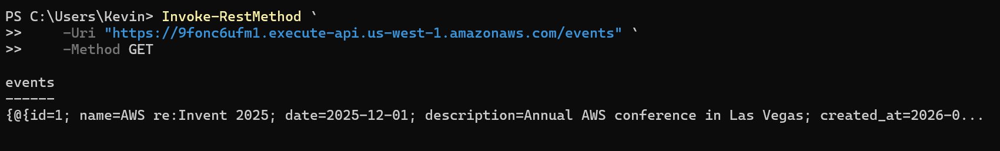

### Email Notification Received
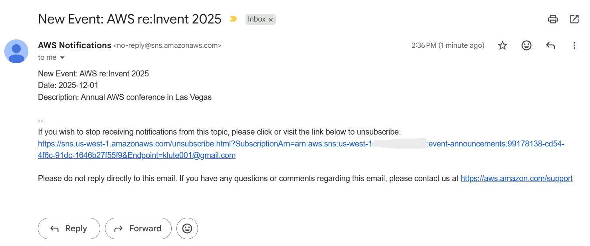

### Updated events.json in S3
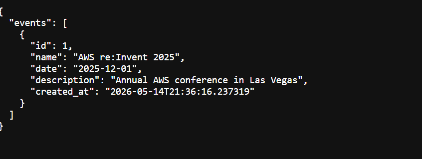

---

## ⚙️ Infrastructure as Code (Terraform)

The environment is fully managed with Terraform. Sensitive values are excluded from source control and provided locally through `terraform.tfvars`.

```bash
# 1. Clone the repo
git clone https://github.com/KevinCloudLabs/aws-serverless-notification-system.git
cd aws-serverless-notification-system

# 2. Set up variables
cp terraform.tfvars.example terraform.tfvars
# add your email address

# 3. Deploy
terraform init
terraform apply

# 4. Confirm the SNS subscription email before testing

# 5. Test
$body = @{
    event_name        = "Test Event"
    event_date        = "2025-12-01"
    event_description = "Testing the notification system"
} | ConvertTo-Json

Invoke-RestMethod -Uri "$(terraform output -raw api_endpoint)/events" -Method POST -Body $body -ContentType "application/json"

# 6. Destroy when done
terraform destroy
```

---

## 📚 What I Learned

- How to wire together serverless services using IAM roles and least-privilege policies
- The difference between SNS and SES and when each is appropriate
- How to make storage decisions based on access patterns and cost — S3 vs DynamoDB
- When HTTP API Gateway is sufficient vs REST API
- The importance of environment variables for keeping configuration out of code

---

## 🤖 A Note on the Python Code

The Lambda functions in this project were written with AI assistance. My background is in cloud infrastructure and architecture — not application development. My focus here was on the AWS service design, IAM permissions model, and Terraform implementation rather than the Python itself.

The functions are intentionally simple: they make AWS SDK calls to S3 and SNS, which is standard boilerplate for Lambda. Understanding what the code does and why — reading from S3, appending an event, writing back, publishing to SNS — was part of the learning. Writing Python from scratch is on my roadmap.

---

## 🧩 Challenges & Lessons Learned

**SNS Subscription Confirmation**

SNS will not deliver notifications until the email subscription is confirmed. After `terraform apply`, an automated confirmation email is sent — clicking confirm is a manual step that has to happen before testing. Easy to miss and easy to forget when rebuilding.


**PowerShell Testing Commands**

I used AI assistance to help write the PowerShell commands for testing the API — I am still learning PowerShell and am not yet comfortable writing commands like that from scratch. The focus for this project was on the AWS architecture and Terraform, not the testing scripts. That said, running the commands and understanding what each part was doing was a useful learning experience.

---
